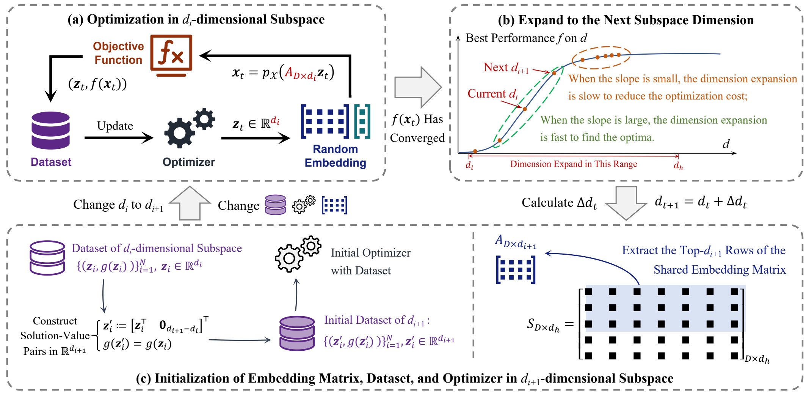

<div align="center">

### Automated Random Embedding for Practical Bayesian Optimization with Unknown Effective Dimension

[](https://www.ijcai.org/)
[](https://www.python.org/)
[](https://pytorch.org/)
[](https://botorch.org/)

Official implementation of **Dynamic Shared Embedding Bayesian Optimization (DSEBO)**, accepted by **IJCAI 2026**.

</div>

---

## 🖼️ Framework

<div align="center">
  
</div>

The framework contains three main stages:

- **Subspace optimization:** optimize the acquisition function in the current low-dimensional embedded space.
- **Dynamic dimension expansion:** decide the next subspace dimension according to the observed improvement trend.
- **Shared embedding warm start:** initialize the next optimizer with historical data projected through the shared embedding matrix.

## 🗂️ Repository Structure

```text
DSEBO/
|-- DSEBO.py                         # Main entry point
|-- Fw.pdf                           # Original framework figure
|-- assets/
|   `-- framework.png                # README-ready framework figure
|-- paper/
|   |-- main.pdf                      # Main paper
|   `-- appendix.pdf                  # Appendix
`-- utils/
    |-- BayesOptimizer.py            # BoTorch-based Bayesian optimizer
    |-- RandomEmbeddingGroup.py      # Shared random embedding module
    |-- functions.py                 # Benchmark function wrappers
    `-- ObjFunc.py                   # Objective function definitions
```

## ⚙️ Installation

Create a clean environment:

```bash
conda create -n dsebo python=3.8
conda activate dsebo
```

Install dependencies:

```bash
pip install numpy torch botorch zoopt
```

## 🚀 Quick Start

Run the default example:

```bash
python DSEBO.py
```

A more explicit run:

```bash
python DSEBO.py \
  --objectiveFunction Sphere \
  --objDim 1000 \
  --effDim 30 \
  --budget 500 \
  --dLow 5 \
  --dHigh 100 \
  --beta 12 \
  --seed 1
```

The script writes results to:

```text
results/<objective>-<budget>/<objDim>-<effDim>/<beta>/
```

including:

- `seed_<seed>_qual.csv`: objective values from queried points;
- `seed_<seed>_optNos.csv`: active embedded dimension at each optimization step.

## 🔧 Key Arguments

| Argument | Default | Description |
| --- | ---: | --- |
| `--seed` | `1` | Random seed |
| `--objDim` | `1000` | Ambient objective dimension |
| `--effDim` | `30` | Effective dimension of the benchmark |
| `--budget` | `500` | Total number of objective evaluations |
| `--objectiveFunction` | `Sphere` | Benchmark objective |
| `--dLow` | `5` | Initial embedded dimension |
| `--dHigh` | `100` | Maximum embedded dimension |
| `--beta` | `12` | Dimension-switching control parameter |

## 📚 Citation

If this repository is useful for your research, please cite our paper:

```bibtex
@inproceedings{dsebo,
  title     = {Automated Random Embedding for Practical {B}ayesian Optimization with Unknown Effective Dimension},
  author    = {Hong Qian and Xiang Shu and Xiang Xia and Xuhui Liu and Yangde Fu and Bei Liang and Huibin Wang and Liang Dou},
  booktitle = {Proceedings of the 35th International Joint Conference on Artificial Intelligence (IJCAI)},
  year      = {2026}
}
```
